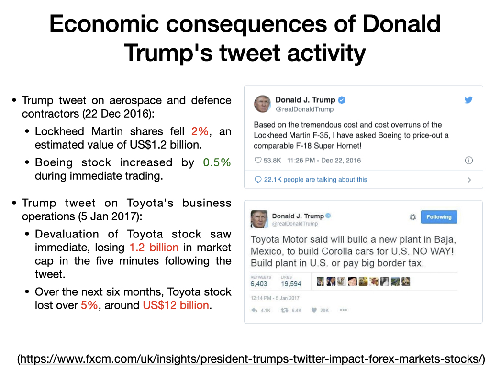

# Analysis of Donald Trump Twitter activity

Donald John Trump, the 45th president of the United States, has pioneered the use of social media for political communication in an unprecedent way. The political and socio-economical consequences of his tweets have, at least in part, shaped the history of USA, with impacts reaching over a million of dollars for certain companies (check this comprehensive [article](https://www.fxcm.com/uk/insights/president-trumps-twitter-impact-forex-markets-stocks/) for more information).

Here, we use the Twitter API and Data Visualization tools to show essential features of Donald Trump's Twitter activity between December 2019 and February 2020:

    - Time course of Tweet activity over weekday and daily hours
    - Historical reasons of outstanding tweet activity
    - Linguistic analysis of tweets
    - Average number of retweets (~16 000 times per tweet)
    - Most active retweeters of Donald Trump's tweets

This work was prepared and presented together with my colleague [Andrea Festanti](https://github.com/afestant) at the [Propulsion Academy](https://propulsion.academy/), batch DS 2020 02 :metal:

> Questions: Contact me at guillaume.azarias@hotmail.com

Thank you for reading !